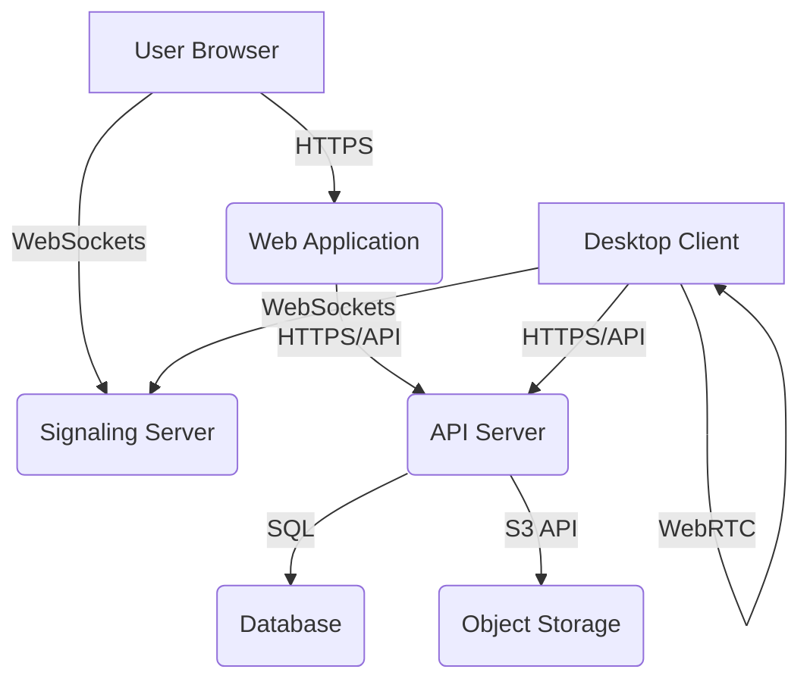

# RemoteDesk Self-Hosting Architecture Document

## Introduction
This document outlines the recommended architecture for self-hosting RemoteDesk, providing guidance on component deployment, network configuration, and infrastructure requirements. It is designed for enterprises that choose to deploy RemoteDesk within their own data centers or private cloud environments.

## Architectural Overview
RemoteDesk's self-hosted architecture consists of several interconnected components:

1.  **Web Application (Next.js):** User-facing dashboard for managing sessions, users, and settings.
2.  **API Server (Node.js/Express):** Handles business logic, database interactions, and external integrations.
3.  **Signaling Server (Socket.IO):** Facilitates WebRTC connection establishment between remote desktop clients.
4.  **Database (PostgreSQL/TiDB):** Stores user data, session information, and configuration settings.
5.  **Desktop Application (Electron):** Client application for initiating and receiving remote desktop sessions.
6.  **Storage (S3-compatible):** For storing session recordings, audit logs, and other large binary data.

## Component Breakdown

### 1. Web Application (`apps/web`)
-   **Technology:** Next.js, React, TypeScript, TailwindCSS.
-   **Deployment:** Can be deployed as a static site with server-side rendering (SSR) capabilities. Requires a Node.js runtime environment or can be built to static assets and served by a web server (Nginx, Apache).
-   **Connectivity:** Communicates with the API Server for data and authentication.

### 2. API Server (`apps/api`)
-   **Technology:** Node.js, Express, TypeScript, Prisma.
-   **Deployment:** A long-running Node.js process. Recommended to run behind a load balancer for high availability and scalability. Requires access to the database and potentially external services.
-   **Connectivity:** Exposes RESTful APIs. Connects to the database and the Signaling Server.

### 3. Signaling Server
-   **Technology:** Socket.IO.
-   **Deployment:** A Node.js application that manages WebSocket connections. Should be deployed with sticky sessions if behind a load balancer to ensure clients reconnect to the same server.
-   **Connectivity:** Clients connect directly to the Signaling Server via WebSockets. Communicates with the API Server for session validation.

### 4. Database
-   **Technology:** PostgreSQL (recommended) or TiDB.
-   **Deployment:** A highly available and fault-tolerant database cluster is recommended for production environments. Backups and disaster recovery strategies are crucial.
-   **Connectivity:** Accessed by the API Server.

### 5. Desktop Application (`apps/desktop`)
-   **Technology:** Electron.
-   **Deployment:** Distributed to end-users. Connects to the Web Application for authentication and the Signaling Server for session initiation.

### 6. Storage
-   **Technology:** S3-compatible object storage (e.g., AWS S3, MinIO).
-   **Deployment:** Can be a cloud-based service or an on-premise object storage solution.
-   **Connectivity:** Accessed by the API Server for storing and retrieving data.

## Network Diagram

## Infrastructure Requirements

### Compute
-   **Web/API/Signaling Servers:** Virtual machines or containers with adequate CPU and memory. Auto-scaling groups are recommended.
-   **Database:** Dedicated machines or managed database services with high I/O capabilities.

### Networking
-   **Load Balancers:** For distributing traffic to Web, API, and Signaling Servers.
-   **Firewalls:** Strict ingress/egress rules to secure communication between components.
-   **DNS:** Proper DNS configuration for all services.

### Storage
-   **Object Storage:** Sufficient capacity for session recordings and audit logs.
-   **Database Storage:** High-performance storage for database files.

## Security Best Practices
-   **TLS/SSL:** Enforce TLS for all communication channels.
-   **Authentication:** Integrate with enterprise identity providers.
-   **Authorization:** Implement fine-grained access control.
-   **Vulnerability Scanning:** Regularly scan all components for security vulnerabilities.
-   **Logging and Monitoring:** Centralized logging and monitoring for all services.

## Scalability Considerations
-   **Stateless Services:** Design Web, API, and Signaling Servers to be stateless for easy horizontal scaling.
-   **Database Sharding/Replication:** For large datasets and high transaction volumes.
-   **Caching:** Implement caching layers to reduce database load.

## Disaster Recovery
-   **Backups:** Regular backups of the database and critical configuration files.
-   **Multi-Region Deployment:** Consider deploying across multiple regions for maximum resilience.
-   **RTO/RPO:** Define and test Recovery Time Objectives (RTO) and Recovery Point Objectives (RPO).
