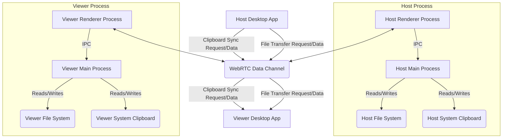

# Threat Model: RemoteDesk Clipboard Sync and File Transfer

This document outlines a threat model for the clipboard synchronization and file transfer features within the RemoteDesk application. The goal is to identify potential threats, vulnerabilities, and mitigation strategies to ensure the security and integrity of user data and the application itself.

## 1. Introduction

RemoteDesk is a full-stack SaaS remote desktop application. This threat model focuses on two critical features that involve data exchange between a host and a viewer: clipboard synchronization and file transfer. Both features handle potentially sensitive user data and interact with the local file system and system clipboard, making them prime targets for malicious actors.

## 2. Scope

This threat model covers:

*   Clipboard synchronization (text-only).
*   File transfer mechanism, including initiation, consent, chunking, and saving.
*   Inter-Process Communication (IPC) between Electron renderer and main processes for these features.
*   Data flow over WebRTC data channels.

Out of scope:

*   Overall WebRTC signaling and connection establishment security.
*   Authentication and authorization mechanisms for remote desktop sessions.
*   Operating system level vulnerabilities outside the application's control.

## 3. Data Flow Diagram (DFD) - High Level

## 4. Trust Boundaries

*   **Between Host and Viewer**: Data transmitted over the WebRTC data channel is considered to cross a trust boundary. While WebRTC provides encryption, the application must validate the content and intent.
*   **Between Renderer and Main Process (Electron)**: The renderer process is untrusted. The main process is trusted and acts as a security boundary for system resources (file system, clipboard).
*   **External Systems**: Any interaction with external systems (e.g., cloud storage for file transfer, if implemented) would introduce new trust boundaries.

## 5. Entry Points

*   User input (copy/paste actions, file selection dialogs, drag-and-drop).
*   Incoming messages from the remote peer via WebRTC data channel.
*   IPC calls from the renderer process to the main process.

## 6. Assets

*   User's clipboard content (potentially sensitive text).
*   User's local files (potentially sensitive documents, executables).
*   Application integrity and availability.
*   User privacy.

## 7. Threats (STRIDE Analysis)

### S - Spoofing

*   **Threat**: A malicious peer spoofs a file transfer or clipboard sync request, pretending to be a legitimate source.
*   **Vulnerability**: Insufficient validation of message origin or session integrity.
*   **Mitigation**: WebRTC data channels are typically tied to authenticated sessions. Ensure session integrity. Rely on explicit user consent for file transfers and clipboard sync.

### T - Tampering

*   **Threat**: A malicious peer or an attacker intercepts and modifies clipboard content or file chunks during transfer.
*   **Vulnerability**: Lack of integrity checks on data in transit or at rest.
*   **Mitigation**: WebRTC data channels provide DTLS encryption and integrity protection. Implement application-level checksums for file chunks to detect tampering before writing to disk. Validate clipboard message structure and content.

### R - Repudiation

*   **Threat**: A user denies initiating a file transfer or enabling clipboard sync.
*   **Vulnerability**: Lack of clear audit trails or explicit consent records.
*   **Mitigation**: Require explicit user action (e.g., clicking 
`Accept` or toggling a switch) for these actions. Log these actions locally (with appropriate privacy considerations) if necessary for auditing.

### I - Information Disclosure

*   **Threat**: Sensitive clipboard data or file contents are exposed to unauthorized parties or logged unnecessarily.
*   **Vulnerability**: Insecure logging practices, lack of encryption in transit (mitigated by WebRTC), or unauthorized access to the application's memory or storage.
*   **Mitigation**: Ensure WebRTC encryption is active. Avoid logging sensitive clipboard content or file data. Implement strict access controls on local storage used by the application.

### D - Denial of Service (DoS)

*   **Threat**: A malicious peer sends excessively large clipboard payloads or initiates numerous large file transfers to exhaust system resources (CPU, memory, disk space, network bandwidth).
*   **Vulnerability**: Lack of size limits, rate limiting, or resource management.
*   **Mitigation**: Enforce strict size limits (`MAX_CLIPBOARD_TEXT_SIZE_BYTES`, `MAX_FILE_SIZE_BYTES`). Limit concurrent file transfers (`MAX_CONCURRENT_FILE_TRANSFERS`). Implement backpressure mechanisms in data channels.

### E - Elevation of Privilege

*   **Threat**: A malicious peer exploits a vulnerability in the file transfer or clipboard sync logic to execute arbitrary code or gain unauthorized access to the system.
*   **Vulnerability**: Path traversal vulnerabilities, buffer overflows, insecure deserialization, or improper handling of executable files.
*   **Mitigation**: Rigorous input sanitization (especially filenames). Strict isolation between renderer and main processes. Token-based access control for file operations. Avoid executing transferred files automatically.

## 8. Specific Vulnerabilities and Mitigations

### 8.1 Path Traversal

*   **Vulnerability**: An attacker crafts a filename like `../../../../Windows/System32/evil.dll` to overwrite critical system files.
*   **Mitigation**: The `sanitizeFilename` function must strip all path traversal sequences. The main process must ensure files are only written to the user-selected directory.

### 8.2 Arbitrary File Write

*   **Vulnerability**: The renderer process is compromised and attempts to write a file to an arbitrary location without user consent.
*   **Mitigation**: The main process must mediate all file writes. The renderer must use a token obtained from a user-approved save dialog to authorize writes.

### 8.3 Malicious File Execution

*   **Vulnerability**: A user unknowingly accepts and executes a malicious file transferred via the application.
*   **Mitigation**: The application should not automatically execute transferred files. Consider adding warnings for potentially dangerous file types (e.g., `.exe`, `.bat`, `.sh`).

### 8.4 Clipboard Injection

*   **Vulnerability**: An attacker sends a crafted clipboard payload designed to exploit vulnerabilities in the application's UI or other software when pasted.
*   **Mitigation**: Currently, only text is supported. If rich text or HTML is supported in the future, rigorous sanitization (e.g., using DOMPurify) is mandatory before rendering or placing it on the system clipboard.

## 9. Conclusion

The clipboard synchronization and file transfer features introduce significant security considerations. By adhering to the principles of least privilege, strict input sanitization, explicit user consent, and robust IPC design, the risks associated with these features can be effectively mitigated. Continuous security review and testing are essential to maintain a strong security posture.
